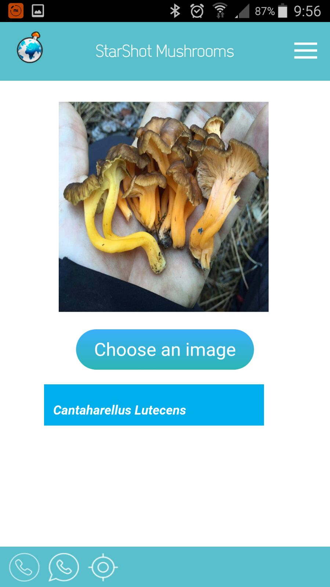

About
=====

I explain how to export weights from a Keras model and import those weights in Keras.js, a JavaScript framework for running pre-trained neural networks in the browser. I show you later how to include the final result into a Phonegap Cordova mobile application. 

Introduction
-----------

We are going to create a mushroom detector application for our mobiles. For this task we need to use a machine learning approximation, and as a good approximation we'll use the [KerasJS](https://github.com/transcranial/keras-js) framework.

First Step: Build an image recognition system for several mushroom families.
-----------

- We need to begin training a Keras model in Python. For this purpose we'll use a transfer learning/fine tuning process over a pre-trained InceptionV3 model. The pipeline will be:

1. Transfer learning: take a ConvNet that has been pre-trained on ImageNet, remove the last fully-connected layer, then treat the rest of the ConvNet as a feature extractor for the new dataset. Once you extract the features for all images, train a classifier for the new dataset.
2. Fine-tuning: replace and retrain the classifier on top of the ConvNet, and also fine-tune the weights of the pre-trained network via backpropagation.

- But first we need the database for the customizable mushroom categories. We have to find a big labeled database with thousands of images of each mushroom family we want to detect. This is not an easy issue, so we can trick a bit by searching and downloading Google Images/Image Links:

We can use this Python script in order to download images from Google base in a set if query strings:

```
google-images-download.py
``` 

This script will download 200 images for each of the specified mushroom families:

```
search_keyword = [
            'Paxinus involutus',
            'sarcosphaera',
            'Inonatus tamaricis',
			...
			...
			];
```

After this process end we'll have a folder with 200 images named with the mushroom family. We have to cut this folders and move them to a new 'train_dir' folder. We need also create a 'val_dir' folder.
In 'val_dir' folder we will have a copy of all downloaded mushroom family folders but just with some images for the validation process (this images cannot be anymore in the 'train_dir' folder).

Now we can start the fine tuning process using the Python Keras script:

```
fine-tune.py.py
``` 

This script will train the mushroom detection model and finally will create as output some weights files we'll use in the next step:

```
model_mushrooms.json
model_mushrooms_metadata.json
model_mushrooms_weights.buf
```

We can use the script: ```predict.py``` to check the accuracy of the training process.

Second Step: Running the Neural Network in the Browser
-----------

We will now create a tiny JavaScript application that loads the previously saved model and weights. Create frontent code and distribution folders:

```
mkdir -p frontend/dist
```

You’ll want to copy the extracted model data files into the frontend/dist directory:

```
cp model_mushrooms.json frontend/dist/
cp model_mushrooms_metadata.json frontend/dist/
cp model_mushrooms_weights.buf frontend/dist/
```

The Webpack Setup:

We will write the code in ES6 and prepare it for the browser using the webpack JavaScript code and asset bundler. So, install webpack and the webpack development server via npm by running

```
npm install webpack -g
npm install webpack-dev-server -g
```

You will also want to start a node project and install the required packages

```
npm init
npm install --save keras-js url-loader
```

- The HTML:

I will use a very basic HTML file placed directly in the 'frontend/dist/index.html' distribution directory, which is generally not a good idea but works for this demonstration.

- The JavaScript:

The actual model loading code will live inside 'frontend/entry.js'

- With the sources in place, compile the bundle with:

```
cd frontend
webpack
```

To view the app, run:

```
webpack-dev-server
```

and open the indicated address (likely http://localhost:8080) in a web browser.

- Testing the web:

Just type in the file input the name of an image file located in the folder 'frontend/dist/' and click the 'Predict' button. After some seconds you will have as output the prediction of the model with the top 3 confidence probabilities.

<br></img><br/> 

Third Step: Running the Neural Network in a Phonegap Cordova application.
-----------

- This step is so simple as creating a new Phonegap project, and copying the former folders into the 'www' folder. Then we can just use a controller to redirect to a page containing our 'frontend/dist/index.html'.

</img><br/>
</img><br/>
</img><br/> 


